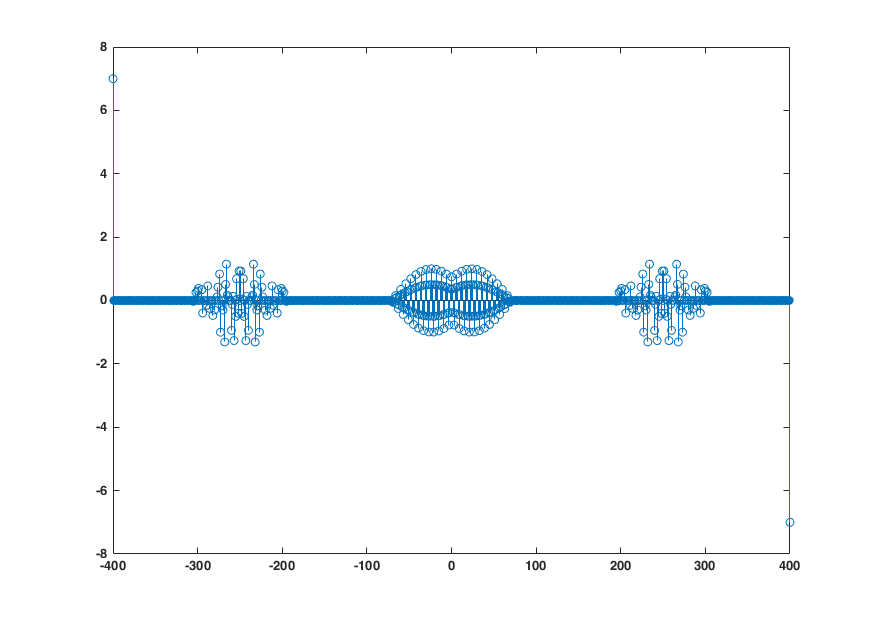
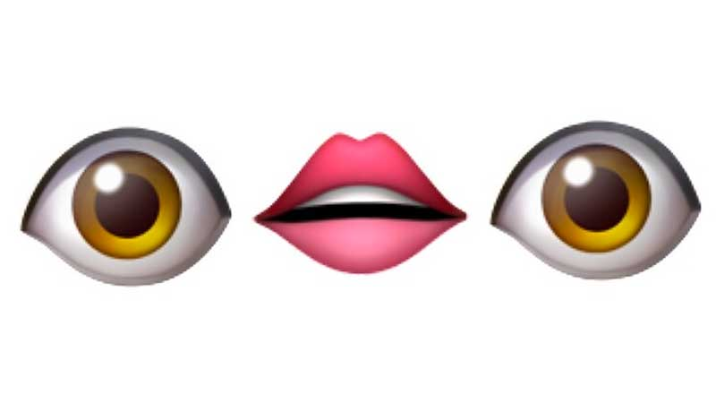

# Emojis en MATLAB
 Diseñar emojis como fruto de combinar funciones matemáticas es un proyecto carente de utilidad. Y, por eso mismo, pienso llevarlo a cabo.

## Introducción
Este proyecto representa el culmen de mi carrera universitaria. Estudiar Ingeniería de Telecomunicaciones puede ser algo realmente ambiguo y abstracto a primera vista.

Sin embargo, con los años uno se da cuenta de que... tenía razón.

 

Esta es la **finalidad última** de los estudios de Telecomunicaciones: saber representar emojis por medio de una herramienta de cálculo asistido por ordenador tan compleja (y cara) como es **MATLAB**.

¿Antenas? ¿Satélites? ¿Microprocesadores? ¿Procesado de datos?

**Nimiedades y baratijas.**

No hay nada comparable a este proyecto tan sumamente serio y con una utilidad en nuestro día a día tan evidente, obvia, trivial, inmediata... que, por tradición, dejo para deducción del lector.

Se aceptan microdonaciones y proyectos de *crowdfunding* para motivarme en esta ardua tarea.

## Colaboración
Son bienvenidas todas las propuestas que se os ocurran.

## Contacto
Puedes contactarme por correo electrónico: [javiolonchelo@gmail.com](mailto:javiolonchelo@gmail.com)

O, si lo prefieres, puedes buscarme en las redes sociales como **\@javiolonchelo**